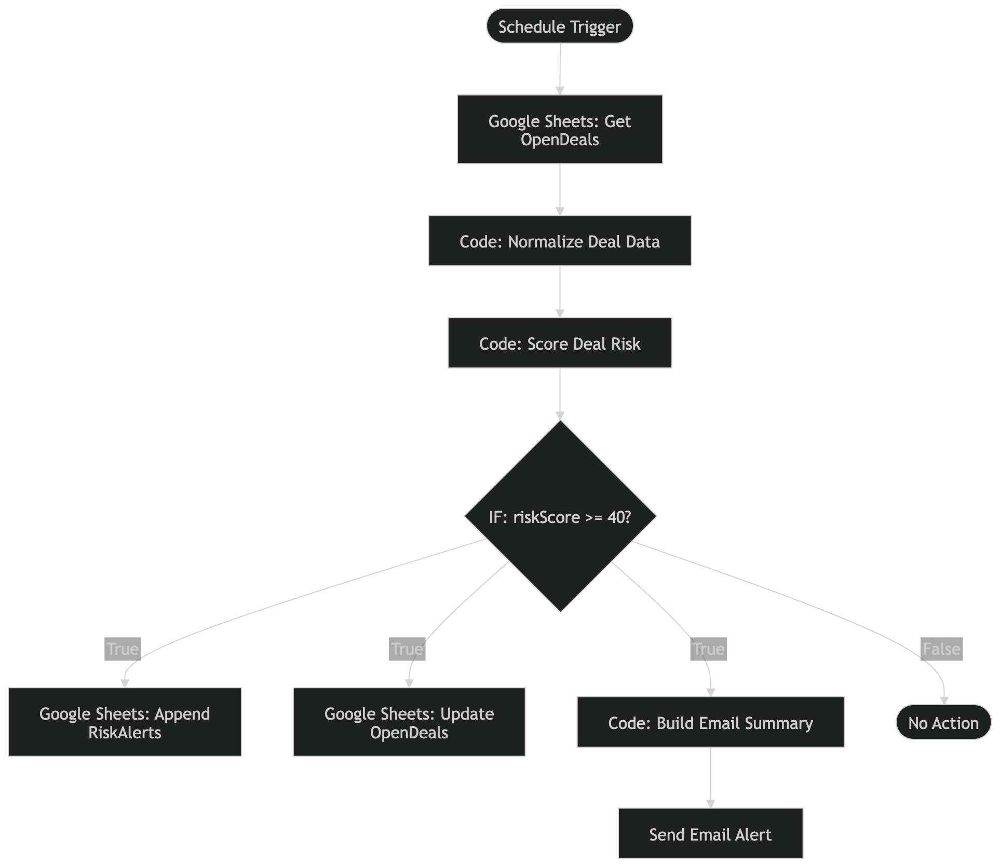
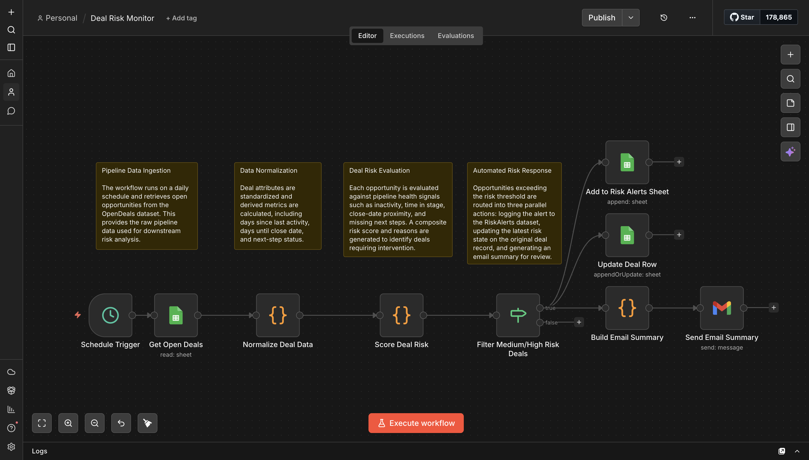

# Deal Risk Monitor

Automated pipeline monitoring system that detects stalled or high-risk deals and alerts sales teams before opportunities are lost.

---

## Overview

Sales teams often lose deals because risk signals appear too late: inactivity, stalled stages, or missing next steps. These signals usually only surface during manual pipeline reviews.

This project implements an **automated pipeline monitoring workflow built in n8n** that continuously evaluates open deals against predefined risk conditions and alerts the team when intervention may be required.

The system demonstrates how workflow automation can function as an **early-warning system for sales pipelines**.

---

## Problem

Revenue teams typically identify deal risk manually by reviewing CRM pipelines. This process creates several challenges:

- Stalled deals go unnoticed  
- Follow-ups are missed  
- Sales leaders lack real-time visibility into pipeline health  
- Forecast accuracy declines when risk signals are detected too late  

A proactive monitoring system allows teams to detect risk **before deals are lost**.

---

## Solution

This workflow monitors open deals and evaluates them against risk signals such as:

- inactivity thresholds  
- excessive time spent in stage  
- missing next steps  
- approaching close dates without engagement
- deal size 

When a deal meets defined risk conditions, the system:

1. Flags the deal as **high risk**
2. Records the deal in a **risk monitoring sheet**
3. Generates an **alert email summarizing the issue**

This allows revenue teams to intervene earlier in the sales cycle.

---

## Workflow Logic

The workflow executes the following process:

1. Retrieve all open deals from the data source  
2. Evaluate each deal using risk scoring rules  
3. Identify deals that exceed defined risk thresholds  
4. Record and update high-risk deals in a monitoring sheet  
5. Generate an alert email summarizing the flagged deals  

---

## Architecture

High-level workflow structure:

Trigger
↓
Fetch Open Deals
↓
Evaluate Risk Conditions
↓
IF High Risk
↓
Add to Risk Alert Sheet
↓
Update Latest Risk Score
↓
Generate Email Summary

---

## Workflow

Below is the n8n workflow used to implement the monitoring system.

---

## Example Risk Conditions

Example rules implemented in the workflow include:

- No activity for **7+ days**
- Deal stuck in stage for **14+ days**
- Missing next step
- Close date approaching without recent engagement

These rules can easily be adjusted depending on the pipeline structure.

---

## Sample Data

Two sample CSV files are included to demonstrate the data structure used by the workflow.

Location:

sample-data/

### sample-open-deals.csv

Represents the pipeline data used as input for the monitoring workflow.  
Each row represents an active deal being evaluated for risk signals.

Example fields:

- DealID  
- Company  
- Owner  
- Stage  
- Amount  
- CreatedDate  
- CloseDate  
- LastActivityDate  
- NextStepDate  
- DaysInStage  
- Status  
- Notes
- LatestRiskScore
- LatestRiskLevel
- LastReviewedAt

---

### sample-risk-alerts.csv

Represents the output structure used to record deals flagged as high risk.  
In a production environment this would typically exist as a separate sheet where flagged deals are logged.

Example fields:

- RunDate
- DealID  
- Company  
- Owner
- Stage
- Amount
- RiskScore
- RiskLevel
- Reasons  
- RecommendedAction 

---

In a real deployment these would typically exist as **two sheets within a pipeline monitoring workbook or CRM export**.  
For portability within this repository they are provided as separate CSV files.

---

## Technology Stack

- **n8n** — workflow orchestration  
- **JavaScript** — rule-based risk evaluation  
- **Google Sheets** — monitoring output  
- **Email node** — alert notifications  

---

## Workflow Export

The full workflow can be imported directly into n8n.

Location:

workflow/deal-risk-monitor-n8n.json

Import path in n8n:

Workflow → Import → JSON

---

## Why This Matters for Revenue Teams

Pipeline risk monitoring is often reactive. By automatically detecting stalled or inactive deals, this system allows sales teams to intervene earlier in the sales cycle.

Earlier intervention can lead to:

- improved win rates  
- healthier pipelines  
- more reliable forecasting  
- better sales execution discipline  

---

## Potential Improvements

Future enhancements could include:

- AI-assisted deal risk scoring  
- CRM integrations (HubSpot or Salesforce)  
- Slack alerts for sales teams  
- automated follow-up task creation  
- pipeline risk analytics dashboards  

---

## License

This project is provided for demonstration and portfolio purposes.
